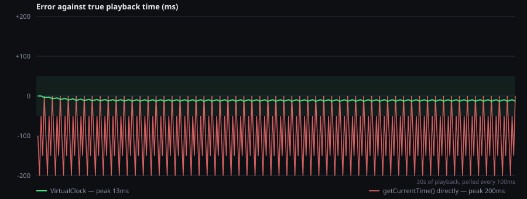

# TuneType

A browser typing game. A YouTube video plays, synced lyrics scroll in time with the song, and you
type each line as it's sung.

The interesting part is the **timing layer**, not the game. See `PROJECT_CONTEXT.md` for the full
design and `docs/` — or the plan this was built from — for what's deferred.

## Running it

```bash
npm install
npm run dev
```

Client on http://localhost:5173, API on http://localhost:8787.

**No cloud setup is needed to play.** Sign-in and YouTube search are both optional and degrade
quietly when unconfigured. Copy `.env.example` to `.env` only when you want them.

## How a run works

1. **Search for the video.** Results come from YouTube in its own relevance order, filtered to
   what can actually be embedded.
2. **Pick one, and the lyrics follow.** Its title and length are matched against LRCLIB — title
   decides which song, length decides which cut of it. Getting this wrong is possible, and the way
   out is the song-first search at `/songs`.
3. **Play.** Press play on the video and start typing. If the lyrics run ahead or behind, nudge
   them with <kbd>←</kbd> / <kbd>→</kbd> (100ms per press).

**The song-first flow still exists at `/songs`**, and is the whole front door on a server with no
`YOUTUBE_API_KEY`: search LRCLIB by title, then pick a video for the track you chose. That
direction is ranked — `Artist - Topic` uploads first, official music videos last — because a known
track is something a video can be scored against. A free-text video search has no track to score
against yet, so it is served in YouTube's order.

## What's built

| | |
|---|---|
| Scaffold, LRCLIB search, LRC parser | done |
| Paste-a-video, IFrame player | done |
| Virtual clock + debug overlay | done |
| Lyric scroller, manual offset nudge | done |
| Typing, accuracy + timing scoring, results | done |
| Firebase auth (optional, guest play default) | done |
| Accounts: saved runs, lifetime stats, per-track bests | done |
| YouTube search proxy with quota-safe caching | done |
| Tap calibration, shared offset consensus, wrong-video demotion | done |
| Required-WPM stat per track | done |
| Curated setlists with difficulty tiers | done (empty — curate them yourself) |

## Accounts

Optional, and layered so that nothing about them can get between you and a song. Signed out — or
with no Firebase project configured at all — the game plays exactly as before and the account UI
hides itself.

The header carries the account: a **Sign in** button when signed out, and once signed in an avatar
with a dropdown — profile and stats, account settings, sign out. Signed in, finishing a run saves
it. `/profile` shows lifetime stats, per-track personal bests and recent history, and is where you
change your display name, avatar and picture, or delete the account outright (profile, every saved
run, and the sign-in credential — there's no undo).

**Profile pictures** are downscaled and re-encoded in the browser to a 256px square, then stored
inline in the profile document as a `data:` URI a few kilobytes long. That's deliberate: no storage
bucket to provision, no CORS to configure, no second set of rules to get wrong, and it all runs on
the credentials everything else already uses. Re-encoding through a canvas also drops EXIF — the
original file, and the GPS coordinates it may carry, never leave the machine. The server accepts
only PNG, JPEG and WebP; SVG is refused because an SVG is a document that can carry script, not a
bitmap. If pictures ever need to be large, that trade flips and they belong in Firebase Storage.

Without a picture you get a generated avatar — initials on a color seeded from your uid, changeable
from a small palette. Google accounts fall back to their provider photo, rendered from Google's URL
rather than copied into our storage, so it stays current if they change it.

Two decisions worth knowing about:

**Saved runs contain no lyrics.** A run reduces to track metadata and counts: score, correct and
typed characters, lines attempted and completed, time spent typing. The lyric lines and everything
you typed stay in memory for the length of the run and are never sent anywhere. `toRunSubmission`
in `client/src/lib/api/account.ts` is the single place that decides what leaves the browser, and
`RunSubmission` in `shared/src/types.ts` is the contract — read one of them before adding a field.

**All account data goes through the server.** The client never touches Firestore; `firestore.rules`
denies every direct client read and write, and the Express routes hold the only key. That's what
lets a run be validated before it lands. It is *not* anti-cheat: scoring happens in the browser
against lyrics the server never sees, so the server has nothing to recompute a run from and anyone
with devtools can post a plausible number. Fine for personal history; not fine for a public
leaderboard, which is the point at which scoring would have to move somewhere verifiable.

## Video search

Optional, like everything else that needs cloud setup: with no `YOUTUBE_API_KEY` the video screen
is the paste form and nothing announces a missing feature.

The binding constraint is quota. A free Google project gets 10,000 units a day, `search.list` costs
100 of them, and there is no graceful degradation — past the limit the API just returns 403 until
midnight Pacific. That is about **100 searches per day for everyone using the server combined**, so
three things guard it:

- **The cache.** A resolved track is stored under normalized `artist|title` and never searched
  again. Deliberately not keyed on the LRCLIB id or duration: one recording is routinely three
  entries — single, album, deluxe reissue — that all want the same video, and keying on the pair
  that identifies the *recording* turns the other two into free hits.
- **The budget.** `YOUTUBE_SEARCH_DAILY_BUDGET` caps searches below the hard limit, and the counter
  persists to Firestore. In-memory alone would reset on every `tsx watch` restart while Google's
  counter kept climbing — a few saves is all it takes to spend a real day's quota against a counter
  reading zero. It rolls over on the **Pacific** day boundary, because that's when Google's does.
- **Asking first.** Opening the video screen loads from cache only. Choosing a track is not the
  same act as requesting a search, and backing out of one shouldn't have cost anything. Known
  tracks appear instantly; a new one gets a button that says how many searches are left today.

Because the budget is checked *after* the cache lookup, running out degrades to "tracks someone has
already looked up" rather than to nothing.

**Ranking** lives in `server/src/youtube/rank.ts` and is pure, so it's tested against fixtures
rather than against whatever YouTube returns today. Tiers run `topic > official > lyric >
musicvideo > other` — the official music video sits *below* lyric videos on purpose, since it's the
cut most likely to carry a spoken intro, a label ident or an edited arrangement. A video shorter
than the track is rejected (radio edit or different version) with two seconds of slack for
rounding; more than five minutes longer is rejected as a full-album upload. Karaoke, live, remix
and cover markers disqualify a result, unless the same word is in the track's own title — so
"Live Forever" doesn't reject itself.

Nothing is ever silently dropped. Rejected candidates are returned, sorted last, and shown behind
one click with the reason attached: these are heuristics reading a title string, and the person
looking at the page can see the video when we can't.

The ranking is recomputed from cached candidates on every read rather than stored, so retuning the
heuristics improves past searches too instead of leaving fossilised orderings that only more quota
could fix.

## The timing layer

This is the part of the project worth reading.

The YouTube player runs in a cross-origin iframe, so there are no audio samples to read and no way
to derive sync automatically. The only time source is `getCurrentTime()`, and it advances in steps
of roughly 250ms. Poll it at 100ms and two thirds of the readings are stale repeats of the last
one.

Using those readings directly is the obvious approach and it fails in a specific way. The reported
position is never ahead of true playback and is usually behind it, by an amount that sweeps from
zero up to a full step and then resets. Lyrics driven off it do not drift — they stutter, holding
still for two frames and then lurching forward. Worse, the error is invisible to the thing that
would catch it: every individual reading looks perfectly reasonable.

`client/src/lib/timing/VirtualClock.ts` runs its own clock and uses the player only to correct it.

**Anchor on step edges, not on every poll.** Any single reading lags true playback by an unknown
0–250ms, so treating each one as ground truth just imports the source's coarseness. But the
*instant the value changes* is precise — at that moment true playback is pinned to within one poll
interval. Only those transitions re-anchor the clock. Repeated readings are discarded without being
looked at, which is the single line that does most of the work here.

**Slew, don't snap.** When a fresh anchor disagrees with where the clock projected it would be,
jumping to the new value is visible as a hitch. Instead the clock's *rate* bends by up to 2% and
the disagreement is absorbed over about a second. Two percent is well under the ~4% where a change
in scroll speed becomes perceptible, so corrections stay invisible. Only a disagreement too large
to be drift — a seek, a stall, a backgrounded tab — earns a hard jump.



Thirty seconds of playback against a player quantized to 250ms, polled every 100ms. Reading
`getCurrentTime()` directly sweeps to **200ms** behind and resets, over and over. The virtual clock
holds **13ms**, never leaving the ±50ms band, across 121 re-anchors and zero hard snaps.

**What that chart is and is not.** It measures the real `VirtualClock`, constructed exactly as the
app constructs it — regenerate it with `npm run chart:drift`, and it will disagree with this prose
if the constants change. What it does not measure is a real video. Polling is perfectly regular
here, the player never stalls, and the network does not exist. Treat 13ms as the floor and ~50ms as
the number to hold against an actual song. The two-thirds-stale figure and the 200ms peak are
properties of the source, and those are real.

The debug overlay on the play screen shows virtual time, polled time, drift and rate while you
play. It is the instrument for every claim above, and the honest way to check whether any of this
survived contact with a real upload.

## Setlists

Every other way into this game is a search and a gamble: you type a title, take whatever LRCLIB
has, and find out whether the video syncs by playing it. A **setlist** is the opposite — a small
hand-picked set where someone has already confirmed all of that, sorted into tiers so there is
somewhere to start and somewhere to work towards.

They ship **empty**. The tiers exist; the songs are yours to curate.

**Easy · Medium · Hard · Insane**, then **Freestyle**. The first four share their names with the
automatic pace bands, because they are one vocabulary with two sources: the estimate reads timings
and suggests a tier, the curator has heard the song and decides. The two disagreeing is
informative — required WPM only measures how fast the words arrive, and cannot see that a song is
all long vowels and repeated choruses, or dense with proper nouns.

**Freestyle sits outside that ladder, and the type system says so.** The four graded tiers are
defined by a range of required WPM, so every song has one whether or not anyone has judged it.
Freestyle has no range and never can — it is the shelf for songs kept for their own sake rather
than for where they rank. So `PaceBand` covers the four measurable tiers and `SetlistTier` is
`PaceBand | 'freestyle'`, which makes it a compile error for a function returning a *measured*
band to return Freestyle. It is the one tier only a curator can choose, it is coloured off the
cool-to-hot scale rather than beyond the end of it, and the ↑/↓ move controls skip it: stepping
"down" from Insane into Freestyle would say it is harder still, so moving on and off it is a
separate, named action.

Each entry previews as a row: YouTube thumbnail, title, artist, required WPM, duration and line
count. Thumbnails come straight from `i.ytimg.com` — no API key, no quota. Spending the day's
hundred searches to render a picture would be absurd.

**A setlist stores pointers, not songs.** An entry holds an LRCLIB id, a video id, metadata and
three aggregate numbers. The lyrics are fetched in the browser at the moment you press play, the
same as for a searched track — `toSetlistSubmission` is the enforcement point, and it is the
sibling of `toRunSubmission`. An entry can outlive the LRCLIB record it points at, which the page
reports as a missing song rather than a broken screen.

### Curating

Set `ADMIN_EMAILS` or `ADMIN_UIDS` in `.env`, restart, and an **Add a song** button appears on the
Setlists tab. Adding pins down two things: which LRCLIB entry supplies the lyrics (chosen from a
search) and which video you checked them against (pasted as a link). A YouTube link alone is not
enough — the words come from a different service matched by artist and title, and the wrong entry
gives you a song whose lyrics are subtly not the ones being sung. Curated entries can be moved
between tiers or removed inline.

Admin rights come from the environment rather than a flag in the database, deliberately. A stored
flag needs some way to create the first admin, and every version of that is either a bootstrapping
endpoint that must be defended forever or a manual console edit indistinguishable from an
attacker's. A value only the person running the server can set has neither problem, and revoking is
deleting a line.

`ADMIN_EMAILS` matches **only provider-verified addresses**. Firebase email/password sign-up will
let anyone register an account claiming any address, so without that check the setting would mean
"whoever types this address into the sign-up form first". Google sign-in arrives verified, so this
costs the real admin nothing. Curation endpoints answer **404 rather than 403** to a signed-in
non-admin — there is nothing to gain from confirming the surface exists to someone who cannot use
it.

Reading is open to everyone, guests included. A curated list is the easiest way into the game, and
putting it behind a sign-in would defeat the point of having one.

## Shared timing — the offset store

Matching a video correctly is not enough. The right recording can still sit a few seconds off its
lyrics because of a title card, a label ident or a different master, and no amount of better
matching fixes a constant shift. The offset does, and since the player is a cross-origin iframe
with no access to audio samples, it cannot be computed — only measured, by a person.

**Positive means the video runs late relative to its lyrics** — the title-card case. That
convention lives in `client/src/lib/timing/offset.ts` and is enforced by tests, because a flipped
sign does not throw: it shifts lyrics the wrong way, which looks exactly like a video that needed
correcting, and only becomes undeniable once the values are shared and half the submitters used
each convention.

Three ways to arrive at one, in increasing order of effort:

- **Inherit it.** The consensus for this video-and-track pairing is fetched when the run starts and
  applied. This is the whole point — once someone has calibrated a video, nobody else has to.
- **Tap along.** Press any key the moment the first line is sung; the gap between when you heard it
  and when the LRC file says it should be is the correction.
- **Nudge.** <kbd>←</kbd> / <kbd>→</kbd>, 100ms a press, as before.

Nothing is submitted automatically. Every submission is a button someone pressed — a value captured
silently at the end of a run would include every abandoned mid-song experiment. Replaying an
inherited consensus unchanged does not count as a measurement either, so an offset cannot vote for
itself and make one person's calibration look confirmed.

**Consensus** (`server/src/offsets/consensus.ts`) is the median of the largest self-agreeing
cluster, not the plain median. Clustering around the median was the first attempt and is subtly
wrong: on an even split — two people calibrated from the intro, two from the first vocal — it lands
in the gap *between* the groups and produces an offset that is wrong for every submitter. Spread is
measured as median absolute deviation rather than standard deviation, since SD is defined against
the mean and one garbage submission would inflate both centre and spread.

Confidence has four states rather than a boolean, which is how two lines of the design that pull
opposite ways are reconciled — "once one user calibrates, everyone after gets it right" wants a
single submission applied immediately, while "only serve an offset above a confidence threshold"
wants restraint:

| | |
|---|---|
| `none` | nobody has calibrated this pairing |
| `provisional` | one or two measurements — applied, but flagged, and the next player is asked to confirm |
| `confirmed` | enough agree closely enough to stop asking |
| `contested` | measurements disagree by seconds |

`contested` is the interesting one, and it is **not** a timing problem. Submissions that disagree by
seconds are not imprecise measurements of one recording — they are precise measurements of several,
which is what a live take, an extended mix or a fan edit looks like from here. So it feeds back into
search: a contested video is rejected from the ranking outright and the next candidate is promoted,
however good its channel and duration looked. That is the loop that makes matching improve on its
own, and it is visibly asymmetric — a *confirmed* timing only reorders candidates within reach of
each other, because "we know how to correct this video" is not the same claim as "this video is
better". Evidence that a video cannot be timed is conclusive in a way that the opposite is not.

Guests may submit. Requiring an account would make coverage depend on sign-ups, and coverage is the
entire value. A signed-in person's later measurement replaces their earlier one rather than stacking
— otherwise someone who nudges through a run outvotes everyone else alone — while guests are not
deduplicated, because there is nothing honest to identify them by and the median absorbs it.

## How hard is this song?

Every track carries a **required WPM**: the typing speed needed to finish every line inside its
window. It comes out of the LRC timings alone, so it is known before a note plays, costs nothing,
and is shown on search results before you commit to a song.

The definition is pinned to the scoring model rather than invented alongside it. A line's window
runs from its timestamp to the next line's, and finishing anywhere inside earns the full timing
multiplier — so required WPM is exactly the pace at which every line lands on time, not one where
you merely survive. It is an estimate in one specific way worth being honest about: it assumes you
start typing the instant a window opens, which nobody does.

Songs demand more than they look. A typical pop track runs 300-450 words over three and a half
minutes, which is 60-100 WPM sustained — above most people's casual typing speed. There is also a
`peakWpm`, the 95th percentile of per-line demand with short ad-libs excluded, because a gentle
average can hide one rapid-fire verse and difficulty tiers will need to tell those apart. The bands
in `client/src/lib/scoring/constants.ts` are first guesses, like every other constant in that file.

The results screen shows it next to what you actually managed, since 70 WPM is fast on a song that
needed 50 and behind on one that needed 90. It is stored on saved runs because the server has no
lyrics to recompute it from — one aggregate number per track, the same standing as `correctChars`.

## Scoring

Accuracy is the base; a timing multiplier rewards finishing a line inside its window, decaying to a
floor of 0.5 over one further window length. **Finishing early is never penalized** — LRCLIB entries
are line-synced rather than word-synced, so "early" usually just means the timestamp ran late.

**WPM is measured per line, not across the run.** Each line's clock starts on its first keystroke
and stops the moment the line is finished; the run's speed divides correct characters by the sum of
those intervals. A song is mostly not typing — instrumental breaks, the gap before the next line is
sung, the outro after the last one — and a clock that ran through all of it would report the
arrangement's pace rather than yours. The results screen shows both numbers, so the gap between
"time typing" and the run's length is visible rather than baked in.

The start of each line's clock is the first keystroke rather than the moment the line appears, on
the same reasoning: line-synced lyrics routinely open a window seconds before the vocal starts, and
that lead-in is the LRC file's slack, not your hesitation.

Every tolerance lives in `client/src/lib/scoring/constants.ts` with the reasoning attached. They're
first guesses, meant to be retuned once you've actually played.

## Lyrics and licensing

Lyrics are publisher-copyrighted, and LRCLIB being free to query confers no license.

The client fetches lyrics **directly from LRCLIB in the browser** — never through our server. That
isn't incidental: it means no cache can form on our side by accident. Lyrics live in memory for the
duration of a run and are never written to disk, never proxied, and never committed. Test fixtures
are synthetic. Nothing in this repo is lyrics content, and it should stay that way.

## Deploying

`.github/workflows/pages.yml` publishes the client to GitHub Pages on every push to `main`. Enable
it once under **Settings → Pages → Source → GitHub Actions**; nothing else is needed.

**What that gets you is the client, and only the client.** Pages serves static files, so there is no
Express process — which means no YouTube search, no accounts, no setlists and no shared offsets.
What remains is the flow the project has always supported with an empty `.env`: search LRCLIB from
the browser, paste a video link, play, and see your results. Every server-backed screen says so
plainly rather than failing; the front page hands over to the song-first search on its own when
nothing answers at `/api`.

Two details make it work under `bitit0.github.io/TuneType/` rather than at a domain root. `BASE_PATH`
is set by the workflow and read by Vite, and the router reads the same value back through
`import.meta.env.BASE_URL`, so the two cannot disagree. `404.html` is a copy of `index.html`, which
is how a deep link like `/setlists/hard` boots the app instead of GitHub's not-found page.

**To get the full app, the server has to live somewhere that runs Node** — Render, Railway and Fly
all have a free tier that fits it. Deploy `server/`, then point the client at it by setting
`VITE_API_BASE` to its URL at build time and adding the Pages origin to `ALLOWED_ORIGINS` on the
server. Nothing else changes; the seam is already there.

## Tests

```bash
npm test
```

Covers the LRC parser, video-ID parsing, the scoring model (including per-line typing time), the
required-WPM analysis, the offset sign convention and consensus arithmetic, the account arithmetic
— lifetime stats, personal bests, display-name handling — the video ranking and quota accounting,
and the virtual clock (driven by a fake player and fake timers, so no video is needed). Nothing here needs a Firebase project or an API key: the account logic is pure functions
and the YouTube tests stub `fetch`, both deliberately separated from their infrastructure so the
suite runs on a fresh clone.

What tests can't cover is whether the sync *feels* right, or whether the scoring tolerances are
fair. That's a manual check against a real song.
